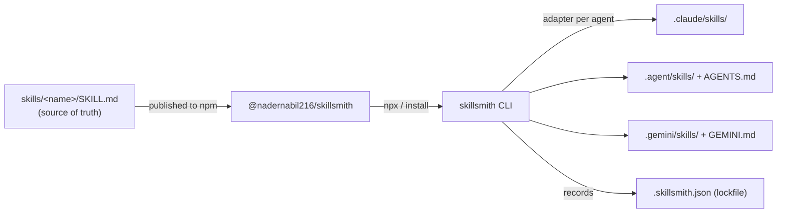

<div align="center">


# 🛠️ skillsmith

**One catalog of AI-agent skills. Install them into _any_ CLI agent. Keep them in sync.**

[](https://www.npmjs.com/package/@nadernabil216/skillsmith)
[](https://www.npmjs.com/package/@nadernabil216/skillsmith)
[](https://nodejs.org)
[](./LICENSE)
[](https://docs.npmjs.com/generating-provenance-statements)

</div>

---

## The problem

Every AI coding agent wants your skills in a **different place, in a different format**:

- Claude Code reads `.claude/skills/<name>/SKILL.md`
- Codex / opencode / GPT-style CLIs read `AGENTS.md`
- Gemini CLI reads `.gemini/` + `GEMINI.md`
- …and Kimi, GLM, and the next tool you try each do their own thing.

So you copy-paste the same playbooks into every project, for every tool, and they instantly drift out of date. There's **no single source of truth and no versioning.**

## What skillsmith does

`skillsmith` is a tiny CLI that turns one versioned catalog of skills into a per‑agent install:

- 📚 **One catalog** — every skill is a `SKILL.md` folder, authored once.
- 🎯 **Any agent** — adapters drop each skill into the right place, in the right format, for the agent you target.
- 🔒 **A lockfile** — `.skillsmith.json` records exactly what's installed so a teammate can reproduce it.
- 🔄 **Updates** — `skillsmith update` pulls the latest catalog and re-syncs everything.
- 🛡️ **Signed** — published with npm provenance attestations.

> A *skill* is just a folder with a `SKILL.md` — YAML frontmatter (`name`, `description`) plus the instructions an agent reads and follows when the task matches.

---

# 🚀 Installation & Usage

> **No install required.** Run any command straight from npm with `npx`. Each block below is a single command — copy it on its own.

### 1. Browse the catalog

```bash
npx @nadernabil216/skillsmith list
```

### 2. Install a skill into your project

Claude Code is the default target. Add one skill:

```bash
npx @nadernabil216/skillsmith add commit-suggest
```

Or another:

```bash
npx @nadernabil216/skillsmith add process-pr-comment
```

Or install the **whole catalog** at once:

```bash
npx @nadernabil216/skillsmith add --all
```

### 3. Target a different agent

Add `--agent <id>` (see the [agent matrix](#supported-agents)):

```bash
npx @nadernabil216/skillsmith add --all --agent codex
```

### 4. (Optional) Install the command globally

```bash
npm install -g @nadernabil216/skillsmith
```

Then call it directly anywhere:

```bash
skillsmith list
```

That's it — the skills are now in your project and your agent will pick them up. ✅

---

## Supported agents

| Agent | `--agent` id | Skills land in | Index file |
|---|---|---|---|
| Claude / Claude Code | `claude-code` *(default)* | `.claude/skills/<name>/` | — (auto-discovered) |
| Codex / GPT CLI | `codex` | `.agent/skills/<name>/` | `AGENTS.md` |
| opencode | `opencode` | `.agent/skills/<name>/` | `AGENTS.md` |
| Gemini CLI | `gemini` | `.gemini/skills/<name>/` | `GEMINI.md` |
| Kimi CLI | `kimi` | `.agent/skills/<name>/` | `AGENTS.md` |
| GLM / Zhipu CLI | `glm` | `.agent/skills/<name>/` | `AGENTS.md` |
| Generic | `generic` | `.agent/skills/<name>/` | `AGENTS.md` |

For agents that don't natively scan a skills folder, skillsmith maintains a **managed block** in their instruction file (`AGENTS.md` / `GEMINI.md`) that lists the installed skills and points at them — so the agent always knows they exist. Your own content in those files is left untouched.

Print the matrix any time:

```bash
skillsmith agents
```

---

## The `skillsmith` CLI

| Command | Scope | What it does |
|---|---|---|
| `list` | — | Show the catalog (★ = installed in this project) |
| `add <skill...>` | per‑skill | Install one or more skills (`--all` for the whole catalog) |
| `remove <skill...>` | per‑skill | Uninstall skills and update the index |
| `update [skill...]` | whole list | Upgrade to the latest catalog, then re-sync installed skills |
| `sync` | whole list | Reproduce the lockfile state (e.g. after `git clone`) |
| `agents` | — | List supported target agents |
| `version` | — | Print the installed catalog version |

**Options**

| Flag | Applies to | Meaning |
|---|---|---|
| `-a, --agent <id>` | `add`, `remove`, `sync`, `update` | Target agent (default: `claude-code`, or the lockfile value) |
| `-g, --global` | all | Operate on your home dir (`~`) instead of the current project |
| `--all` | `add` | Install every skill in the catalog |
| `--no-self-upgrade` | `update` | Re-sync only; skip the npm self-upgrade step |

> **Mental model:** `add` / `remove` change *what you've selected* (they edit the lockfile). `sync` *reproduces* the lockfile as‑is. `update` *advances* it to the latest catalog. Each command does exactly one thing.

---

## How it works



- **Catalog** — every skill is a self‑contained `SKILL.md` folder, versioned by a content hash.
- **Lockfile** — `.skillsmith.json` in your project records the target agent and which skills (at which versions) are installed. `sync` reproduces it on any machine.
- **Adapters** — each agent maps to a target directory and, when needed, a managed block in its instruction file.

---

## 📚 The skill catalog

Run `skillsmith list` for the live set. Today the catalog ships with:

### `commit-suggest`

**Why it matters:** turns a pile of staged changes into a clean, conventional commit message that matches your repo's style — so your history stays readable, searchable, and reviewable.

**What it does, in steps:**

1. Inspects exactly what's staged (`git diff --staged`) — it never invents changes.
2. Reads recent history to match your convention (Conventional Commits, ticket prefixes, or plain sentences).
3. Drafts an imperative subject (≤ 50 chars) plus a body that explains the *why* when the change isn't trivial.
4. Shows you the message and waits for your confirmation before committing.

**Install:**

```bash
npx @nadernabil216/skillsmith add commit-suggest
```

### `process-pr-comment`

**Why it matters:** makes sure **no review comment slips through** — every one becomes a code change, a reply, or a tracked follow-up, so reviews close faster and cleaner.

**What it does, in steps:**

1. Gathers the PR's discussion and inline threads (via the `gh` CLI).
2. Triages each comment into one of: change requested · question · nit · out-of-scope.
3. Makes minimal, focused edits for the requested changes, referencing the comment.
4. Drafts a specific reply per thread and summarizes every comment with the action taken — nothing skipped.

**Install:**

```bash
npx @nadernabil216/skillsmith add process-pr-comment
```

---

## Keeping skills up to date

Upgrade the catalog and re-sync everything you have installed:

```bash
skillsmith update
```

Update just one skill:

```bash
skillsmith update commit-suggest
```

Reproduce an exact set on a fresh checkout (the lockfile is committed to your repo):

```bash
npx @nadernabil216/skillsmith sync
```

---

## Verify a release

Check the published version and metadata:

```bash
npm view @nadernabil216/skillsmith
```

Install the latest straight from the public registry:

```bash
npx @nadernabil216/skillsmith@latest list
```

Published builds carry a [provenance attestation](https://docs.npmjs.com/generating-provenance-statements) linking the tarball back to the exact GitHub Actions run that built it.

---

## Contributing

Skills and adapters are both welcome:

- **A new skill** → add a folder under `skills/` with a `SKILL.md`, then open a PR.
- **A new agent** → add an entry to `AGENTS` in `src/adapters.js` (target dir + optional index file).

---

## License

[MIT](./LICENSE) © Nader Nabil

<div align="center">
<sub>If skillsmith saves you a copy-paste, give it a ⭐ — it helps others find it.</sub>
</div>
