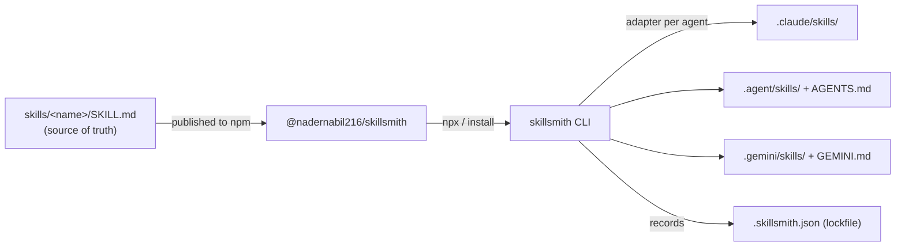

<div align="center">


# 🛠️ skillsmith

**One catalog of AI-agent skills. Install them into _any_ CLI agent. Keep them in sync.**

[](https://www.npmjs.com/package/@nadernabil216/skillsmith)
[](https://www.npmjs.com/package/@nadernabil216/skillsmith)
[](https://nodejs.org)
[](./LICENSE)
[](https://docs.npmjs.com/generating-provenance-statements)

</div>

---

> **skillsmith is a tool that carries a catalog of AI-agent skills and installs any of them into the agent you're using with a single line:**
>
> ```bash
> npx @nadernabil216/skillsmith add <skill>
> ```
>
> One catalog → any agent (Claude, Codex, Gemini, Kimi, GLM, opencode), always versioned and in sync.

## The problem

Every AI coding agent wants your skills in a **different place, in a different format**:

- Claude Code reads `.claude/skills/<name>/SKILL.md`
- Codex / opencode / GPT-style CLIs read `AGENTS.md`
- Gemini CLI reads `.gemini/` + `GEMINI.md`
- …and Kimi, GLM, and the next tool you try each do their own thing.

So you copy-paste the same playbooks into every project, for every tool, and they instantly drift out of date. There's **no single source of truth and no versioning.**

## What skillsmith does

`skillsmith` is a tiny CLI that turns one versioned catalog of skills into a per‑agent install:

- 📚 **One catalog** — every skill is a `SKILL.md` folder, authored once.
- 🎯 **Any agent** — adapters drop each skill into the right place, in the right format, for the agent you target.
- 🔒 **A lockfile** — `.skillsmith.json` records exactly what's installed so a teammate can reproduce it.
- 🔄 **Updates** — `skillsmith update` pulls the latest catalog and re-syncs everything.
- 🛡️ **Signed** — published with npm provenance attestations.

> A *skill* is just a folder with a `SKILL.md` — YAML frontmatter (`name`, `description`) plus the instructions an agent reads and follows when the task matches.

---

# 🚀 Installation & Usage

> **No install required.** Run any command straight from npm with `npx`. Each block below is a single command — copy it on its own.

### 1. Browse the catalog

```bash
npx @nadernabil216/skillsmith list
```

### 2. Install a skill into your project

Claude Code is the default target. Add one skill:

```bash
npx @nadernabil216/skillsmith add commit-suggest
```

Or another:

```bash
npx @nadernabil216/skillsmith add process-pr-comments
```

Or install the **whole catalog** at once:

```bash
npx @nadernabil216/skillsmith add --all
```

### 3. Target a different agent

Add `--agent <id>` (see the [agent matrix](#supported-agents)):

```bash
npx @nadernabil216/skillsmith add --all --agent codex
```

### 4. (Optional) Install the command globally

```bash
npm install -g @nadernabil216/skillsmith
```

Then call it directly anywhere:

```bash
skillsmith list
```

That's it — the skills are now in your project and your agent will pick them up. ✅

---

## Supported agents

| Agent | `--agent` id | Skills land in | Index file |
|---|---|---|---|
| Claude / Claude Code | `claude-code` *(default)* | `.claude/skills/<name>/` | — (auto-discovered) |
| Codex / GPT CLI | `codex` | `.agent/skills/<name>/` | `AGENTS.md` |
| opencode | `opencode` | `.agent/skills/<name>/` | `AGENTS.md` |
| Gemini CLI | `gemini` | `.gemini/skills/<name>/` | `GEMINI.md` |
| Kimi CLI | `kimi` | `.agent/skills/<name>/` | `AGENTS.md` |
| GLM / Zhipu CLI | `glm` | `.agent/skills/<name>/` | `AGENTS.md` |
| Generic | `generic` | `.agent/skills/<name>/` | `AGENTS.md` |

For agents that don't natively scan a skills folder, skillsmith maintains a **managed block** in their instruction file (`AGENTS.md` / `GEMINI.md`) that lists the installed skills and points at them — so the agent always knows they exist. Your own content in those files is left untouched.

Print the matrix any time:

```bash
skillsmith agents
```

---

## The `skillsmith` CLI

| Command | Scope | What it does |
|---|---|---|
| `list` | — | Show the catalog (★ = installed in this project) |
| `add <skill...>` | per‑skill | Install one or more skills (`--all` for the whole catalog) |
| `remove <skill...>` | per‑skill | Uninstall skills and update the index |
| `update [skill...]` | whole list | Upgrade to the latest catalog, then re-sync installed skills |
| `sync` | whole list | Reproduce the lockfile state (e.g. after `git clone`) |
| `restore [id]` | — | Restore a folder from the trash (no id ⇒ list; `--last` ⇒ newest) |
| `trash list\|empty` | — | Inspect or clear the managed trash |
| `agents` | — | List supported target agents |
| `version` | — | Print the installed catalog version |

**Options**

| Flag | Applies to | Meaning |
|---|---|---|
| `-a, --agent <id>` | `add`, `remove`, `sync`, `update` | Target agent (default: `claude-code`, or the lockfile value) |
| `-g, --global` | all | Operate on your home dir (`~`) instead of the current project |
| `--all` | `add` | Install every skill in the catalog |
| `--no-self-upgrade` | `update` | Re-sync only; skip the npm self-upgrade step |
| `--dry-run` | `add`, `remove`, `sync`, `update` | Print what would change; touch nothing on disk |
| `-y, --yes` | `add`, `remove`, `sync`, `update` | Skip the confirmation prompt (required when non-interactive) |
| `--force` | `restore` | Overwrite an existing target when restoring |
| `--last` | `restore` | Restore the most recently trashed entry |
| `--older-than <days>` | `trash empty` | Only drop entries older than N days |

> **Mental model:** `add` / `remove` change *what you've selected* (they edit the lockfile). `sync` *reproduces* the lockfile as‑is. `update` *advances* it to the latest catalog. Each command does exactly one thing.

---

## 🛡️ Safety & design

skillsmith writes files on your machine, so it's built to be a careful guest — and to be *verifiable* rather than merely trusted:

- **Zero runtime dependencies.** It uses only the Node standard library — see [`package.json`](./package.json) (no `dependencies` block). There is no `node_modules` tree to audit and no transitive supply-chain surface.
- **No `curl | bash`, no `sudo`.** Install is plain `npx` or `npm install -g`. It never asks for elevated privileges, never edits your shell rc files, never touches system paths.
- **Scoped writes, guarded.** Skill folders only ever land under the target agent's directory (e.g. `.claude/skills/<name>/`). Skill names are validated and every destination is checked to be inside the project root, so a malformed name can't escape via `../`. Symlinked destinations are refused.
- **Reversible deletes.** Overwriting or removing a skill never permanently deletes it — the old folder is **moved to `~/.skillsmith/trash`** and can be brought back with `skillsmith restore`. This works identically on **macOS, Windows and Linux** (it's a self-managed directory, deliberately not the OS Recycle Bin, which would require a third-party package and reintroduce supply-chain risk).
- **No surprise mutations.** Use `--dry-run` to preview any command without touching disk. Writing to your home directory (`--global`) or removing skills asks for confirmation, and refuses to run non-interactively (CI, pipes) unless you pass `--yes`.
- **Signed releases.** Published with [npm provenance attestations](https://docs.npmjs.com/generating-provenance-statements) linking each tarball to the GitHub Actions run that built it.

```bash
skillsmith add commit-suggest --global --dry-run   # preview, change nothing
skillsmith restore                                 # list what's recoverable
skillsmith restore --last                          # undo the last removal/overwrite
skillsmith trash empty --older-than 30             # housekeeping
```

> Trash entries older than 30 days are pruned automatically on the next run.

---

## How it works



- **Catalog** — every skill is a self‑contained `SKILL.md` folder, versioned by a content hash.
- **Lockfile** — `.skillsmith.json` in your project records the target agent and which skills (at which versions) are installed. `sync` reproduces it on any machine.
- **Adapters** — each agent maps to a target directory and, when needed, a managed block in its instruction file.

---

## 📚 The skill catalog

Run `skillsmith list` for the live set. Today the catalog ships with four skills. `process-pr-comments` and `review-pr` are two sides of the same coin — one **addresses** review feedback, the other **produces** it — and `process-pr-comments` calls `commit-suggest` at its commit step. `process-pr-comments-lite` is a fast, hands-off variant of the first.

---

### 🧩 `commit-suggest`

> Suggest a commit message for your current changes, **following your project's own commit-message guide** — and only suggest, never commit.

**Why it matters:** consistent, ticket-tagged, *why*-focused commit messages keep history searchable and reviewable. This skill writes one in your repo's exact style and hands control back to you — it never runs `git commit`.

**How it handles its work — step by step:**

1. **Reads the real change.** Runs `git status --short` and `git diff HEAD` so the message reflects what actually changed, not a guess from filenames; on a huge diff it falls back to `--stat` plus the most relevant hunks.
2. **Derives the ticket ID** from the branch name (`feature/EPTA-47-…` → `[EPTA-47]`), or notes that none was found.
3. **Composes the message** to its embedded rules (below).
4. **Presents it** in a copyable block, flags any staged-vs-unstaged mismatch (since `git commit` without `-a` only captures staged files), and stops — *you* decide whether to commit.

<details>
<summary><b>The commit-message rules it enforces</b></summary>

- **Header** — ticket ID in `[BRACKETS]` when available · **imperative** verb (`Add`, `Fix`, `Refactor`, `Update`) · no trailing period · focused on the *what*.
- **Body** — explains the *why*, never restates the diff. **Bug fixes** use `**Issue**` / `**Solution**` sections; **features** use a `**Changes**` bullet list; trivially-scoped changes may be title-only.
- **Avoids** — vague/meta messages (`WIP`, `apply PR comments`, `minor fixes`), describing *how* the code works, or more than one blank line between sections.

</details>

**Install:**

```bash
npx @nadernabil216/skillsmith add commit-suggest
```

---

### 🔎 `process-pr-comments`

> An end-to-end workflow for addressing **unresolved review comments on a GitHub PR, GitLab MR, or Bitbucket PR** — forge-agnostic, code-validated, and approval-gated.

**Why it matters:** review feedback is easy to lose track of. This skill makes sure **every unresolved comment is seen, judged against the real code, and either resolved or consciously skipped** — then turns recurring feedback into durable project rules so the same notes don't come back.

**Two modes:** **simple** (default) does the core loop; **advanced** ("deep"/"thorough") adds rule extraction, design-tool checks, and a REST fallback when no CLI is present.

**How it handles its work — step by step:**

1. **Resolve inputs & context.** Asks for the PR/MR number and mode in **one** prompt (never inferred from the current branch), detects the forge from the git remote, and checks the CLI (`gh`/`glab`/`bb`). Your conventions file, validation command, and `commit-suggest` are looked up only when first needed.
2. **Set up the branch.** Checks out the source branch and merges the target, so review runs against an up-to-date tree (handling conflicts with you if they arise).
3. **Fetch comments.** Pulls only the **unresolved** threads, walking every reply and task; exits early if there's nothing to address.
4. **Score & validate.** Scores each comment **1–5, validated against the actual code** (and, in advanced mode, against the design tool for visual comments).
5. **Present & decide.** Presents comments in batches for an *Apply / Skip / Modify* decision — or, in auto mode, applies valid ones from a single summary table.
6. **Plan & implement.** Drafts an implementation plan for your **approval**, then applies the approved changes.
7. **Commit.** Suggests a commit message — reusing **`commit-suggest`** when it's installed.
8. **Extract rules (advanced).** Distills durable rules from what was applied/rejected into `docs/pr-review-rules.md` and points your conventions file at them.

> It **never posts replies** to the forge and **never commits** without your say-so — suggested replies are shown inline only so you can copy them yourself.

**Install:**

```bash
npx @nadernabil216/skillsmith add process-pr-comments
```

---

### ⚡ `process-pr-comments-lite`

> A fast, hands-off variant of `process-pr-comments`: give it a PR/MR number and it **implements the comments that are logically valid** against the code, saves recurring feedback as rules, and stops.

**Why it matters:** sometimes you just want the valid review comments applied without stepping through batches, plans, and prompts. This does exactly that — and nothing else.

**How it differs from `process-pr-comments`:** no user input, no per-comment approval, no implementation-plan gate, no `commit-suggest`, no commit. It validates each comment against the real code, applies the sound ones, writes the rules to `docs/pr-review-rules.md`, and prints a short applied/skipped summary. Reach for the full skill when you want control at each step; reach for this when you want it done.

**Install:**

```bash
npx @nadernabil216/skillsmith add process-pr-comments-lite
```

---

### 🔬 `review-pr`

> A universal **PR review** workflow — compares a branch against its target and produces severity-ranked findings on architecture, clean code, SOLID design, and test quality, in any language.

**Why it matters:** where `process-pr-comments` *addresses* feedback, this skill *produces* it. It reviews a diff the way a senior engineer would — grounded in the actual code, never inventing findings — and hands you a copy-pasteable report without disturbing your current checkout.

**Two modes:** **simple** (default) reviews the diff and reports severity-ranked findings (🔴 blocker · 🟠 major · 🟡 minor · 🔵 nit) with a verdict. **advanced** ("deep"/"thorough") also dedups against comments other reviewers already left, adds security / performance / dependency dimensions, and can optionally build + test the branch in a throwaway worktree.

**How it handles its work — step by step:**

1. **Resolves inputs** — the source and target branches (via `gh`/`glab` when present, pure git otherwise).
2. **Triages the change** — size, shape, and intent from the diff stat and commit log before reading any code.
3. **Inspects the diff** — reads each change in its surrounding context, separating issues the PR *introduces* from pre-existing ones.
4. **Checks the code** against architecture, clean-code / SOLID, and test-quality checklists.
5. **Verifies every finding** — re-confirms each against the diff before reporting, dropping anything it can't stand behind.
6. **Reports** — a plain-English summary, a verdict (approve / approve with nits / request changes), and findings with ` ```suggestion ` blocks where a one-click fix fits.

> In advanced mode it can post replies and reactions to existing comments — but **only on your explicit approval**, never automatically.

**Install:**

```bash
npx @nadernabil216/skillsmith add review-pr
```

---

## Keeping skills up to date

Upgrade the catalog and re-sync everything you have installed:

```bash
skillsmith update
```

Update just one skill:

```bash
skillsmith update commit-suggest
```

Reproduce an exact set on a fresh checkout (the lockfile is committed to your repo):

```bash
npx @nadernabil216/skillsmith sync
```

---

## Verify a release

Check the published version and metadata:

```bash
npm view @nadernabil216/skillsmith
```

Install the latest straight from the public registry:

```bash
npx @nadernabil216/skillsmith@latest list
```

Published builds carry a [provenance attestation](https://docs.npmjs.com/generating-provenance-statements) linking the tarball back to the exact GitHub Actions run that built it.

---

## Contributing

Skills and adapters are both welcome:

- **A new skill** → add a folder under `skills/` with a `SKILL.md`, then open a PR.
- **A new agent** → add an entry to `AGENTS` in `src/adapters.js` (target dir + optional index file).

---

## License

[MIT](./LICENSE) © Nader Nabil

<div align="center">
<sub>If skillsmith saves you a copy-paste, give it a ⭐ — it helps others find it.</sub>
</div>
