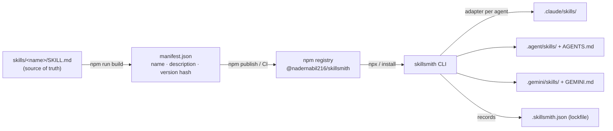

<div align="center">

# 🛠️ skillsmith

**One catalog of AI-agent skills. Install them into _any_ CLI agent. Keep them in sync.**

[](https://www.npmjs.com/package/@nadernabil216/skillsmith)
[](https://www.npmjs.com/package/@nadernabil216/skillsmith)
[](https://nodejs.org)
[](./LICENSE)
[](https://docs.npmjs.com/generating-provenance-statements)

</div>

---

## The problem

Every AI coding agent wants your skills in a **different place, in a different format**:

- Claude Code reads `.claude/skills/<name>/SKILL.md`
- Codex / opencode / GPT-style CLIs read `AGENTS.md`
- Gemini CLI reads `.gemini/` + `GEMINI.md`
- …and Kimi, GLM, and the next tool you try each do their own thing.

So you copy-paste the same playbooks into every project, for every tool, and they instantly drift out of date. There's **no single source of truth and no versioning.**

## What skillsmith does

`skillsmith` is a tiny CLI that turns one versioned catalog of skills into a per‑agent install:

- 📚 **One catalog** — every skill is a `SKILL.md` folder, authored once.
- 🎯 **Any agent** — adapters drop each skill into the right place, in the right format, for the agent you target.
- 🔒 **A lockfile** — `.skillsmith.json` records exactly what's installed so a teammate can reproduce it.
- 🔄 **Updates** — `skillsmith update` pulls the latest catalog and re-syncs everything.
- 🛡️ **Signed** — published from CI via npm Trusted Publishing (OIDC) with provenance attestations.

> A *skill* is just a folder with a `SKILL.md` — YAML frontmatter (`name`, `description`) plus the instructions an agent reads and follows when the task matches.

---

## Quick start

No install required — run it straight from npm with `npx`:

```bash
# Browse the catalog
npx @nadernabil216/skillsmith list

# Install skills into the current project (Claude Code by default)
npx @nadernabil216/skillsmith add commit-suggest process-pr-comment

# Target a different agent
npx @nadernabil216/skillsmith add --all --agent codex
```

Prefer a persistent command? Install it globally:

```bash
npm install -g @nadernabil216/skillsmith
skillsmith list
```

That's it — the skills are now in your project and your agent will pick them up.

---

## Supported agents

| Agent | `--agent` id | Skills land in | Index file |
|---|---|---|---|
| Claude / Claude Code | `claude-code` *(default)* | `.claude/skills/<name>/` | — (auto-discovered) |
| Codex / GPT CLI | `codex` | `.agent/skills/<name>/` | `AGENTS.md` |
| opencode | `opencode` | `.agent/skills/<name>/` | `AGENTS.md` |
| Gemini CLI | `gemini` | `.gemini/skills/<name>/` | `GEMINI.md` |
| Kimi CLI | `kimi` | `.agent/skills/<name>/` | `AGENTS.md` |
| GLM / Zhipu CLI | `glm` | `.agent/skills/<name>/` | `AGENTS.md` |
| Generic | `generic` | `.agent/skills/<name>/` | `AGENTS.md` |

For agents that don't natively scan a skills folder, skillsmith maintains a **managed block** in their instruction file (`AGENTS.md` / `GEMINI.md`) that lists the installed skills and points at them — so the agent always knows they exist. Your own content in those files is left untouched.

```bash
skillsmith agents   # print this matrix any time
```

---

## The `skillsmith` CLI

| Command | Scope | What it does |
|---|---|---|
| `list` | — | Show the catalog (★ = installed in this project) |
| `add <skill...>` | per‑skill | Install one or more skills (`--all` for the whole catalog) |
| `remove <skill...>` | per‑skill | Uninstall skills and update the index |
| `update [skill...]` | whole list | Upgrade to the latest catalog, then re-sync installed skills |
| `sync` | whole list | Reproduce the lockfile state (e.g. after `git clone`) |
| `agents` | — | List supported target agents |
| `version` | — | Print the installed catalog version |

**Options**

| Flag | Applies to | Meaning |
|---|---|---|
| `-a, --agent <id>` | `add`, `remove`, `sync`, `update` | Target agent (default: `claude-code`, or the lockfile value) |
| `-g, --global` | all | Operate on your home dir (`~`) instead of the current project |
| `--all` | `add` | Install every skill in the catalog |
| `--no-self-upgrade` | `update` | Re-sync only; skip the npm self-upgrade step |

> **Mental model:** `add` / `remove` change *what you've selected* (they edit the lockfile). `sync` *reproduces* the lockfile as‑is. `update` *advances* it to the latest catalog. Each command does exactly one thing.

---

## How it works



- **Catalog** — every skill is a self‑contained folder under `skills/`. `npm run build` scans them and regenerates `manifest.json` (name, description, per‑skill content hash). _Adding a skill = dropping a folder; there's no registry to hand‑edit._
- **Lockfile** — `.skillsmith.json` in your project records the target agent and which skills (at which versions) are installed. `sync` reproduces it on any machine.
- **Adapters** — each agent maps to a target directory and, when needed, a managed block in its instruction file.

---

## The starter catalog

| Skill | Use it when… |
|---|---|
| **`commit-suggest`** | writing or improving a git commit message for staged changes |
| **`process-pr-comment`** | triaging, responding to, or resolving review comments on a pull request |

More skills are added over time — run `skillsmith list` for the current set, and `skillsmith update` to pull new ones.

---

## Keeping skills up to date

The npm package **is** the version. Once new skills are published, users get them with one command:

```bash
skillsmith update          # upgrade the catalog + re-sync everything you have
skillsmith update commit-suggest   # just one skill
```

Reproduce an exact set on a fresh checkout (the lockfile is committed to your repo):

```bash
git clone <your-project> && cd <your-project>
npx @nadernabil216/skillsmith sync
```

---

## Creating a new skill

1. Create a folder under `skills/` with a `SKILL.md`:

   ```
   skills/your-skill/SKILL.md
   ```

   ```markdown
   ---
   name: your-skill
   description: One line — when an agent should use this skill.
   ---

   # Your Skill

   Step-by-step instructions the agent follows…
   ```

2. Regenerate the manifest and (optionally) test locally:

   ```bash
   npm run build
   node bin/cli.js list
   ```

3. Release it (see below). Users then run `skillsmith update`.

> Keep skills **agent-agnostic**: describe the workflow and reasoning, lean on portable tools (`git`, `gh`), and don't assume a specific agent's tool names.

---

## Publishing (maintainers)

This package uses **npm Trusted Publishing (OIDC)** — no `NPM_TOKEN` secret, and provenance attestations are generated automatically. (npm classic tokens were revoked in Dec 2025.)

**First publish — manual, one time** (a trusted publisher can only be attached to an existing package):

```bash
npm login                         # sign in
npm publish --otp=<code>          # public via publishConfig.access; 2FA code required
```

**Enable OIDC** on npmjs.com → your package → **Settings → Trusted Publisher → GitHub Actions**:

| Field | Value |
|---|---|
| Organization or user | `NaderNabil216` |
| Repository | `skillsmith` |
| Workflow filename | `publish.yml` |

**Every release after that is hands-off** — push a version tag and CI publishes via OIDC:

```bash
npm run build && git commit -am "feat: add a skill"
npm version patch                 # bumps package.json + tags
git push --follow-tags            # tag → .github/workflows/publish.yml publishes
```

> The runner needs npm ≥ 11.5.1 and Node ≥ 22.14.0 for OIDC — the workflow handles both.

---

## Verify a release

```bash
npm view @nadernabil216/skillsmith              # version, metadata
npx @nadernabil216/skillsmith@latest list       # install from the public registry
```

Published builds carry a [provenance attestation](https://docs.npmjs.com/generating-provenance-statements) linking the tarball back to the exact GitHub Actions run that built it.

---

## Project layout

```
skillsmith/
├─ bin/cli.js                   # CLI entry (list / add / remove / update / sync / agents)
├─ src/
│  ├─ catalog.js                # loads manifest + skill sources
│  ├─ adapters.js               # per-agent targets + managed index
│  ├─ lockfile.js               # .skillsmith.json
│  ├─ install.js                # add / remove / sync core
│  └─ util.js                   # helpers, frontmatter, semver
├─ scripts/build-manifest.js    # scans skills/ → manifest.json
├─ skills/<name>/SKILL.md       # the catalog
├─ .github/workflows/publish.yml
└─ manifest.json                # generated
```

Zero runtime dependencies.

---

## Contributing

Skills and adapters are both welcome:

- **A new skill** → add a folder under `skills/`, run `npm run build`, open a PR.
- **A new agent** → add an entry to `AGENTS` in `src/adapters.js` (target dir + optional index file).

---

## License

[MIT](./LICENSE) © Nader Nabil

<div align="center">
<sub>If skillsmith saves you a copy-paste, give it a ⭐ — it helps others find it.</sub>
</div>
